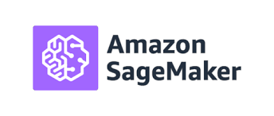

<!--
*** Thanks for checking out this README Template. If you have a suggestion that would
*** make this better, please fork the repo and create a pull request or simply open
*** an issue with the tag "enhancement".
*** Thanks again! Now go create something AMAZING! :D
-->


<!-- PROJECT SHIELDS -->
<!--
*** I'm using markdown "reference style" links for readability.
*** Reference links are enclosed in brackets [ ] instead of parentheses ( ).
*** See the bottom of this document for the declaration of the reference variables
*** for contributors-url, forks-url, etc. This is an optional, concise syntax you may use.
*** https://www.markdownguide.org/basic-syntax/#reference-style-links
-->


<!-- PROJECT LOGO -->
<br />
<p align="center">
  <a href="https://github.com/HBOCodeLabs/max-datascience-content-airflow">
    
  </a>

  <h3 align="center">Sagemaker Airflow</h3>

  <p align="center">
    <br />
    <a href="https://github.com/HBOCodeLabs/max-datascience-content-airflow"><strong>Explore the docs </strong></a>
    <br />
    <br />
    <a href="https://github.com/HBOCodeLabs/max-datascience-content-airflow">View Demo</a>
    ·
    <a href="https://github.com/HBOCodeLabs/max-datascience-content-airflow/issues">Report Bug</a>
    ·
    <a href="https://github.com/HBOCodeLabs/max-datascience-content-airflow/issues">Request Feature</a>
  </p>
</p>

<!-- TABLE OF CONTENTS -->
## Table of Contents

* [About the Project](#about-the-project)
  * [Built With](#built-with)
* [Getting Started](#getting-started)
  * [Prerequisites](#prerequisites)
  * [Installation](#installation)
* [Usage](#usage)
  * [Example Deployment of Model](#example-deployment-of-model)
* [Contact](#contact)


<!-- ABOUT THE PROJECT -->
## About The Project

To analyze data and evaluate machine learning models on SageMaker, use Amazon SageMaker Processing. With Processing, you can use a simplified, managed experience on SageMaker to run your data processing workloads, such as feature engineering, data validation, model evaluation, and model interpretation.
This project helps to execute the datascience model using Sagemaker processing job in a scheduled manner using Airflow orchestration tool.

### Built With
The Sagemaker Job Processing framework is built with python SDK which uses an open source tool [Papermill](https://pypi.org/project/papermill/)  to execute the Jupyter notebook in the Sagemaker instance by using the dependent docker images from ECR repositories.
The dependent docker images are built in the AWS Codebuild and finally pushed to ECR repositories 

All the framework codes,base kernel images, Docker files are maintained [here](https://github.com/HBOCodeLabs/cloudops-aws-sagemaker-execution)

## Sagemaker Model Usage
A folder has to be created with the model name in max-datascience-content-airflow repository under <b>Sagemaker_Models</b> folder.
your Model folder may contain the below files/folders.

1. single notebook file or versioning of your notebook files
2. requirements.txt :- This is where we can request additional packages uses by notebook and which needs to be installed prior to executing the notebook. Ignore adding this file if your model doesn't require any  additional packages. Developers can pass thier own 
3. parameters.json(Optional) :- define all your parameters in this file, the same will be passed to notebook while executing the processing job. If multiple version of notebooks are there make sure you versioned variables inside the file. This file is global to this model so common for all notebooks inside it. You can also create your json file with any name but in order to use it for your notebook, you must supply file name to param_file_name attribute in yml sagemaker task.Please ignore adding this file incase your notebook doesn't have parameters.
4. lib folder (optionlal):- This folder is to define your own custom python files which can be imported to your notebook. Please ignore adding this folder incase notebook doesn't have dependent files.

## Glue Model Usage
A folder has to be created with the model name in max-datascience-content-airflow repository under <b>Glue_Models</b> folder.
your Model folder may contain the below files/folders.

1. single spark python script or multiple scripts. If you want to execute multiple scrips for the same model within the same dag then you need to define separate glue task for each script in the yml config.
2. requirements.txt(Optional)  :- This is where we can request additional packages uses by script and which needs to be installed prior to executing the script. Ignore adding this file if your model doesn't require any  additional packages.
3. parameters.json(Optional)   :- define all your parameters in this file, the same will be passed to script while executing the glue job. please ignore adding this file incase script doesn't need arguments.
4. lib folder(Optional) :- This folder is to define your own custom python files which can be imported to your glue script. Please ignore adding this folder incase notebook doesn't have dependent files.


### Deployment of Sagemaker Model

#### 1. Pipeline Architecture & Functional Workflow

Architecture of the Framework and the workflow is available in the Cofluence.[Link to Confluence](https://confluence.homeboxoffice.com/display/DAT/Sagemaker+Job+Processing)

#### 2. Maintaining Models in the repository
<b>Sagemaker: </b>
A folder should be created with the model name in max-datascience-content-airflow repository under [Models/](https://github.com/HBOCodeLabs/max-datascience-content-airflow/tree/develop/Sagemaker_Models) folder.

<b>Glue: </b>
A folder should be created with the model name in max-datascience-content-airflow repository under [Glue_Models/](https://github.com/HBOCodeLabs/max-datascience-content-airflow/tree/develop/Glue_Models) folder. 

#### 3. DAG generator and YAML configuration
DAG is deployed in Airflow environment by uploading a yaml file with all the required configuration as explained as follows.path dags/resources/config
DAG generator reads the yaml file and generate the DAG dynamically with the mentioned DAG tasks.

```
#================================================================================================
# Importing sagemaker common configuration
#================================================================================================

CommonConf: !include common/snowflake_common_config.yml               <<Imports snowflake configuration details from common/snowflake_common_config.yml file>>

#================================================================================================
# Configuration sagemaker/glue processing Job pipeline
#================================================================================================


dags:
  sagemaker:
    domain: "max"                                 
    sub_domain: "job_process"
    action: "ForecastDaily" 				<<domain+sub_domain+action together will give the dag_id in airflow
                                                          suggester value is your notebook file name>>
    default_args:                                       <<Default arguments for the DAG to be deployed>>
      owner: "DAP OPS"                                  <<must change to your name or email id>>     
      depends_on_past: True                       
      start_date: "2020-08-4"                           << start date of the dag>>
      email_prod: "DAPOperationsSupport@hbo.com"        <<mention email id to get the alerts on failure in prod environment>>  
      email_nonprod: "bobby.dirisala@hbo.com"           <<mention email id to get the alerts on failure in non-prod environment>>
      email_on_failure: True                            <<set flag to send emails or not>>
      email_on_retry: True                              <<set flag to send emails or not on retry of the dag>>
      retries: 3                                        << number of retries>>
      domain: "sagemaker"                               << do not change>>
      retry_delay: 15                                   << retry delay>>
    schedule_interval: "55 19 * * *"  		        <<Cron expression when the Airflow should be triggered>>
    max_active_runs: 1
    catchup: False
    schema: "VIEWERSHIP"                                << snowflake schema name to execute queries >>
    model_name: ""                         << folder name you have created under Models folder in this repo>>
    glue_model_name: ""                                 << folder name you created under Glue_Models folder in this repo>>
    slack_channel:                                      <<mention your slack channel name to get the success,retry,failure alerts from airflow. Failed to provide this attribute
      NON-PROD: ""                                      leads to not send alerts to slack>>
      PROD: ""

    tasks:                                              <<Tasks to be defined in the Airflow>>
    
    
      - name: "ecr_container_creation"                   << do not change>>
        type: "BashOperator"                             << do not change>>
	kernel: "python3"                                <<Base kernel image for the notebook to process.. available kernels/allowed mentioned below 
                                                         python3,python2,tensorflow2_p36,tensorflow_p36,tensorflow_p27, mxnet_py36
							 mxnet_py27,pytorch_p36 >>
	requirements_file_name:""                        <<Optional, This helps in scenario like executing multiple notebooks with different kernels in the same model.
	                                                  If not set/used, default to requirements.txt file

      - name: "sagemaker_notebook_job_processing_script"     << do not change>>
        type: "BashOperator"                                 << do not change>>
	notebook_name: "DailyForecast"                      << notebook file name that you created under above mentioned folder ie.,model_name .. keep it empty with enclosed  
                                                              double quotes incase you only have glue job or snowflake task as part of this dag>>
	param_file_name:"test"                               <<please add this attribute if you want to use your named json file instead of default parameters.json file.
	                                                     If not set, default to parameters.json>>
        Details:                                             << do not change>>
          instance_type: "ml.m5.large"                   <<mention  type  of instance to execute your notebook>>
          instance_count: 1                              <<mention no.of  instances incase model is distributed >>
	  volume_size_InGB: 40                           <<mention how much volume it needs by the instance, default :40GB>>
	templates_dict:                                  <<optinal, will be included 
          dt: "{{ macros.ds_add(ds,1) }}"                <<dt holds the dag execution date, airflow uses macros to retrieve the dag information>>
          yr: "{{ macros.yr(macros.ds_add(ds,1)) }}"     << you can also access airflow variables using macros>>
          mo: "{{ macros.mo(macros.ds_add(ds,1)) }}"     <<all the templates_dict objects can be accessible in the notebook as paramters>>
          dy: "{{ macros.dy(macros.ds_add(ds,1)) }}"
        BucketIOConfig:                                  <<<mention bucket details for each environment to store input and output notebook files.
	                                                 Default path will be created with below format
							 "s3://<model_bucket>/sagemaker-models-<envirnoment_name>/model_name/notebook_name/" and 
					                 input and output folders will available inside it>>>  
          DEV: 
            model_bucket: "<<mention dev bucket>>"      
          BETA:
            model_bucket: "<<mention beta bucket>>"
          PROD:
            model_bucket: "<<mention prod bucket"
        upstream_task_name: "ecr_container_creation"     <<mandatory to set your upstrean dependency as ecr_container_creation task
	                                                  It requires containerto be created mandatorily before this task gets triggered.>>

      - name: "write_to_snowflake"
        model_type: ""                                  << allowed values: glue,sagemaker. By default it looks pipeline folder in the Models/<<model_name>>/ 
	                                                if pipeline folder is created under Glue_Models/<<glue_model_name>>/ use model_type as glue>>
        templates_dict:
          stage: "{{ var.value.CI_STAGING }}"                   << stage name will be retrieved from airflow variable >>
          dt: "{{ macros.ds_add(ds,1) }}"                       <<ds pulls the execution run date of the dag>>
          yr: "{{ macros.yr(macros.ds_add(ds,1)) }}"
          mo: "{{ macros.mo(macros.ds_add(ds,1)) }}"
          dy: "{{ macros.dy(macros.ds_add(ds,1)) }}"
          perc: "{{ 80 }}"
        upstream_task_name: "sagemaker_notebook_job_processing_script"
        sql_file_names:                                         <<mention your list of sql files that you placed in under /Models/<your model_name>/pipeline/ >>
          - "sample.sql"


      - name: "glue_job_processing_script"
        type: "BashOperator"
        Details:
          script_name: "movies-test"                  <<mention the spark/python script name that you have placed under(/Glue_Models/<model_name>/ ) and want to execute 
	                                              NOTE: do not include .py extension>>
	  script_loc: "model"                  	      <<Mandatory, Allowed values: model, common
	                                              model-> will consider the main glue script,lib,jars from the model folder
						      common-> will consider the main glue script from common folder and jar,lib,py files from script named folder in the common                                                       folder. Use common when script needs to be shared with other models along with it's jars,lib,py files.>>
	  param_file_name: ""		              <<Optional, Add this attribute if you want to use your named json file instead of default parameters.json file.
	                                               If not set, default to parameters.json in the model>>
	  requirements_file_name: ""		      <<Optional,  Add this attribute if you want to use your named requirements file instead of default parameters.json file.
	                                               If not set, default to requirements.txt in the model>>
          worker_type: "G.1X"                         <<Allowed values: standard,G.1X,G.2X >>
          number_of_workers: "10"                     <<For G.1X and G.2X worker types, you must specify the number of workers that are allocated 
	                                              when the job runs.The maximum number of workers you can define is 299 for G.1X, and 149 for G.2X.>>
        templates_dict:                                  <<optinal, will be included 
          dt: "{{ macros.ds_add(ds,1) }}"                <<dt holds the dag execution date, airflow uses macros to retrieve the dag information>>
          yr: "{{ macros.yr(macros.ds_add(ds,1)) }}"     << you can also access airflow variables using macros {{ var.value.<<airflow variable name>> }}>>
          mo: "{{ macros.mo(macros.ds_add(ds,1)) }}"     <<all the templates_dict objects can be accessible in the notebook as paramters>>
          dy: "{{ macros.dy(macros.ds_add(ds,1)) }}"
	BucketIOConfig:                               <<<mention bucket details for each environment to store input and dependencies.
	                                              Default path will be created with below format
						      "s3://<model_bucket>/glue-models-<envirnoment_name>/model_name/script_name/" and 
					              /input folder will contain your script and /lib,/jar folders contains egg file,jars for the model
						      /temp will store the intermediate results/internal data proecess by AWSGlue
						      /common_lib,/common_jars,/pub_dependencies,/common_py_files paths will be created under input when script_loc set                                                               common>>
          DEV: 
            model_bucket: "<<mention dev bucket>>"      
          BETA:
            model_bucket: "<<mention beta bucket>>"
          PROD:
            model_bucket: "<<mention prod bucket>>"


      - name: "external_task_dag_status"                  <<name of your external task sensor task>>
        type: "ExternalTaskSensor"                        <<do not chnage>>
        external_dag_details:                             <<do not change>>
          external_dag_id: "max_conviva_DQ"               <<mention dag id which you want to sense it>> 
          external_task_id: "action_email_events"         <<mention task id to sense in the above mentioned dag. Menntion None if DAG level check>>
          allowed_states: "success,failed"                <<Allowed values success,running,failed >>
          poke_interval: 60 * 5                           <<Time in seconds that the job should wait in between each tries>>
	  timeout:                                        <<Time in seconds before the task time out and fails, default : 60 seconds>>
          mode: "poke"                                    << poke | reschedule >>
          execution_delta: timedelta(hours=0, minutes=0)  << time difference with the previous execution to look at, the default is the same execution_date 
	                                                  as the current task or DAG.For yesterday, use [positive!] datetime.timedelta(days=1). Either
                                                          execution_delta or execution_date_fn can be passed to ExternalTaskSensor, but not both.
        upstream_task_name: "<<mention your dependency task here>>"
	
      - name: "python_script_workspace_test_table"        <<mention your bash python script task name>. It should start withpython_script >>
        type: "BashOperator"                              <<do not change>>
        model_type:  "glue"                              <mention where your python script resides, It looks for python_scripts folder either in glue(Glue_Models) or                                                                     sagemaker model (Models). Allowed values : glue,sagemaker
        script_loc: "model"                               <<allowed values: model, common. If model mentioned it looks for <<script_name>>.py in python_scripts folder either in 
	                                                  glue model or sagemaker model based on <<model_type>>. If common mentioned it looks for <<script_name>>.py Py_Models                                                             folder and it's dependencies (like params,requirements,lib) in <<script_name>> folder under Py_Models folder.
        script_name: "data_validation_v1"
        param_file_name: "data_validations"           <<Json file name.Use argparse module to capture this parameters inside the python script. argument format: --key value>>
        templates_dict:
          env: "{{ var.value.ENV }}"                  << env paramter will have ENV airflow variable value>>
    


```

NOTE : please find link https://docs.aws.amazon.com/glue/latest/dg/add-job.html for details about job type,glue version,python version,worker type and number of workers

#### DAG Tasks

DAG created through the  DAG generator by passing the above YAML config comprises of three tasks.

| Task name      | Task type | Description                                                                                                                |
|----------------|-----------|-----------------------------------------------------------------------------------------------------------------|
| `ecr_container_creation`| Bash Operator| A new Docker image is created using the base image as kernel given in the yaml config and install the required dependencies inside inside the image. Note: The new images is created only if there is change in requirements.txt file available inside the reqpective models folder.       |
| `sagemaker_notebook_job_processing_script`  | Bash Operator| Jupyter notebook is processed inside the sagemaker instance using the papermill tool by taking in the input notebook from S3 and writing an output to the target s3 bucket path along with output files. |
| `write_to_snowflake`  | Python Operator| The Data from output files are written to the snowflake table.|
| `glue_job_processing_script`  | Bash Operator| execute spark code using aws glue job.|
| `<<mention task name>>`  | ExternalTaskSensor | Waits for a different DAG or a task in a different DAG to complete for a specific execution_date.|
|`python_script`  | Bash Operator | To excute python scripts on airflow server|


#### 4. Sagemaker/Glue/Bash python files Parameters (parameters.json)

`parameters.json` is used to define necessary parameters imported in the beginning of the notebook/glue/bas python files. you can also create named paramters json file 
and same can be referred inside your task using param_file_name attribute.

Developers needs to use below environment sensitive parameters format to create paramters.json (or named paramters json file). Framework retrieves based on the environment 
and COMMON paraeters will be pulled automatically irrespective of current environment.

Parameter Example:
```python
{
    "DEV":
    {
        "input_path": "s3://datascience-ci-personalization-dev/foundation-data/catalog-foundation/staging",
        "output_path": "s3://datascience-ci-personalization-dev/Content_Similarity/top_n_output",
        "output_scores_path": "s3://datascience-ci-personalization-dev/Content_Similarity/top_n_scores_output",
        "transfer_path": "s3://datascience-ci-personalization-dev/Content_Similarity/production/hbomax/us/similar",
        "feature_path": "s3://datascience-ci-personalization-dev/Content_Similarity/feature_embeddings",
        "matrix_path": "s3://datascience-ci-personalization-dev/Content_Similarity/similarity_matrix",
        "audit_path": "s3://datascience-ci-personalization-dev/Content_Similarity/audit_metrics"
    },
    "BETA":
    {
        "input_path": "s3://datascience-ci-personalization-beta/foundation-data/catalog-foundation/staging",
        "output_path": "s3://datascience-ci-personalization-beta/Content_Similarity/top_n_output",
        "output_scores_path": "s3://datascience-ci-personalization-beta/Content_Similarity/top_n_scores_output",
        "transfer_path": "s3://datascience-ci-personalization-beta/Content_Similarity/production/hbomax/us/similar",
        "feature_path": "s3://datascience-ci-personalization-beta/Content_Similarity/feature_embeddings",
        "matrix_path": "s3://datascience-ci-personalization-beta/Content_Similarity/similarity_matrix",
        "audit_path": "s3://datascience-ci-personalization-beta/Content_Similarity/audit_metrics"
    },
    "PROD":
    {
        "input_path": "s3://datascience-ci-personalization/foundation-data/catalog-foundation/staging",
        "output_path": "s3://datascience-ci-personalization/Content_Similarity/top_n_output",
        "output_scores_path": "s3://datascience-ci-personalization/Content_Similarity/top_n_scores_output",
        "transfer_path": "s3://hurley-ml-models-data-production/production/hboMax/us/similar",
        "feature_path": "s3://datascience-ci-personalization/Content_Similarity/feature_embeddings",
        "matrix_path": "s3://datascience-ci-personalization/Content_Similarity/similarity_matrix",
        "audit_path": "s3://datascience-ci-personalization/Content_Similarity/audit_metrics"
    },
    "COMMON":
    {
        "model_ver": 1,
        "model_ver_b": 2,
        "data_ver": "1.0.0",
        "data_ver_b": "1.1.0",
        "top_n": 25,
        "space_min": 0.001,
        "space_max": 1,
        "metric": "blended",
        "n_top_eval": 3,
        "max_evals": 15,
        "features_delta": 5,
        "titles_delta": 30,
        "min_accuracy": 0.77
	}
}
```

<b>Glue Parameters NOTE:</b> -- will be added to the paramter keys automatically while passing to the glue job hence please don't add -- <br/>
         please ignore this file creation incase your glue job doesn't have any parameters.<br/>


### Git Branches
This project has the intention of using GitFlow as branching strategy to work in a collaborative environment. 
The table describe the functionality of the main branches.

| Branch name    | Description                                                                                                                |
|----------------|----------------------------------------------------------------------------------------------------------------------------|
| `master`       | Master branch, holds latest Production released code. **_This is a protected branch._**                                    |
| `develop`  | DEV environment branch, used only to deploy the code into DEV env.                                                         |
| `beta` | BETA environment branch, used only to deploy the code into BETA env.                                                       |
| `production` | PROD environment branch, used only to deploy the code into PROD env.                                                       |


#### Multi-Notebook Execution For A Model Using Single DAG/ Notebook versioning

Please find sample configuration [here](https://github.com/HBOCodeLabs/sagemaker-airflow/blob/release/dev/dags/resources/config/sagemaker_job_process_Content_ReRank_Inference.yml)

#### Model Versioning:

1) Add New Notebook with New Model Version under the specific Model folder. i.e. `/Models/Content_Similarity/Content_Similarity_V2.ipynb`.

2) Add your named paramters json file(example Content_Similarity_V2.json) for the model notebook version that you have created.

3) create a sagemaker job processing task in yml file by  mentioning your notebook and paramters named file names. (like notebook_name: "Content_Similarity_V2.ipynb" 
   and param_file_name: "Content_Similarity_V2")

#### Shared Glue job sample configuration
[here] (https://github.com/HBOCodeLabs/sagemaker-airflow/blob/release/dev/dags/resources/config/sagemaker_job_process_DAP_Testing.yml) 

#### Shared bash python scripts sample configuration
[here] (https://github.com/HBOCodeLabs/sagemaker-airflow/blob/release/dev/dags/resources/config/sagemaker_job_process_DAP_Testing.yml)

## Contact
Contact DAPAdmin&Support@hbo.com for any additional information.
